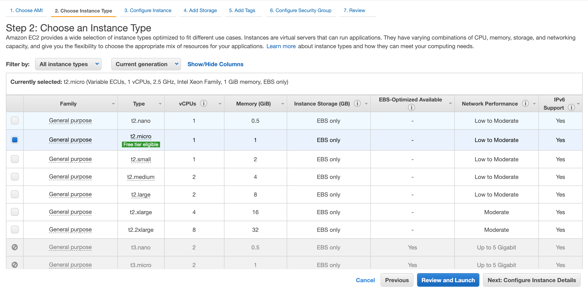
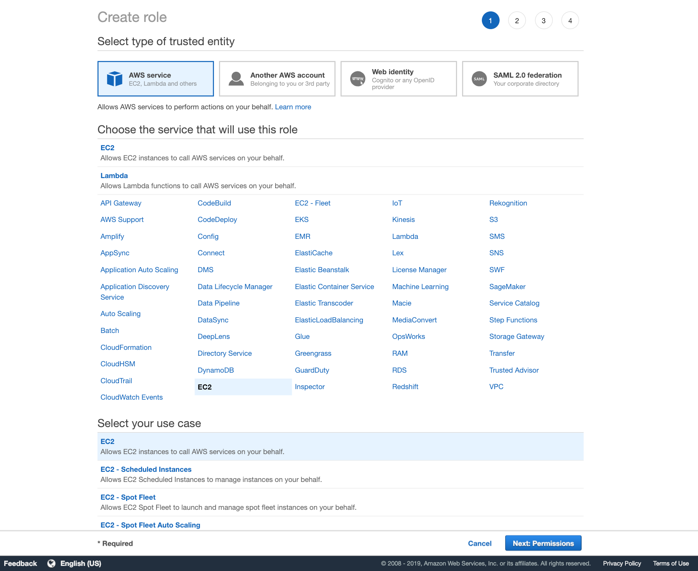
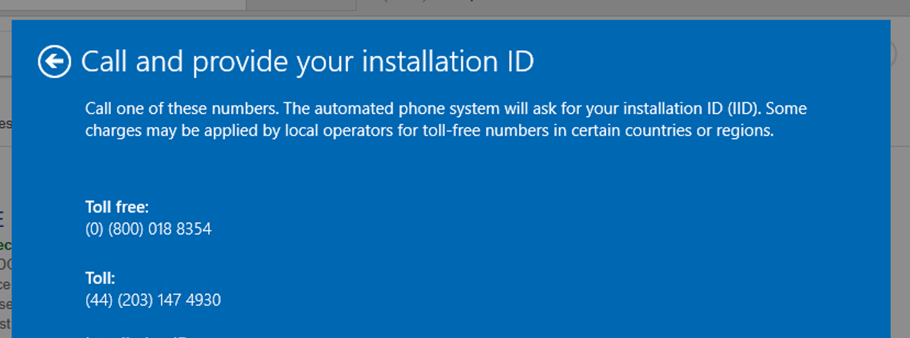

## Summary


Currently (28/1/19), there are Windows 10 AMI backups stored at https://eu-west-1.console.aws.amazon.com/ec2/v2/home?region=eu-west-1#Images:visibility=owned-by-me;search=windows;sort=name

These AMI backups contain fully imported Windows 10 VMs that are configured with the appropriate testing environment (Katalon Studio, necessary directory config, web browsers installed and Windows license activated).

If you want to quickly create a new Windows Instance, select one of the Windows instances (it should have 'Windows 10 - Licensed activated' as the AMI Name) and click Launch. See `AWS: Launching an instance from the AMI` below for how to do this.

If you want to create a VM from scratch ie end-to-end, following the entire process detailed below start ing with `Setup the VM (high level)`

## Setup the VM (high level)
1) Download and install the AWS Command Line Interface.

2) Create and install the Windows 10 VM using Virtual Box

3) Run the VM checker tool

- The checker will see if there are any issues with the Windows configuration, such as dynamic pagefiles, date/time registry entries and root administrator access.

* Note: At time of writing (10/1/19), the top 2 entries in the BYOL Checker refer to an incompatible version of Windows. This did not stop me from successfully installing and connecting to the Windows 10 EC2 instance over RDP.

- When the checklist is satisfied, you will then need to export the VM to an OVA file. See
https://www.maketecheasier.com/import-export-ova-files-in-virtualbox/ for information on how to export the vm.

4) Upload the VM

5) Launching an instance from the AMI

6) Download and install Microsoft Remote Desktop

### Resources

- VM Import/Export: https://aws.amazon.com/ec2/vm-import/

----

## Download and install the AWS Command Line Interface.

The best resource to use to install the AWS CLI is https://docs.aws.amazon.com/cli/latest/userguide/install-macos.html#install-bundle-macos-os-prereq

## Create and install the Windows 10 VM using Virtual Box

1) Open Virtual Box

2) Click New

3) Git the VM a name

4) Choose Windows 10 64bit

5) Set Ram to 4096

6) Select Create a Virtual Hard Disk now

7) Keep the file size to 50GB. It may be worth using 20GB as recommended minimum by Microsoft

8) Choose VHD format (althugh VDI has worked befre so dont think this matters too much)
  
9) Click Start

10) Download a Windows 10 64 bit iso from https://www.microsoft.com/en-gb/software-download/windows10ISO
- Once it has downloaded you will need to select it within Virtual Box

11) Start the VM

12) Set UK where possible then click Install button

13) If you have a license enter, if not, select 'I dont have a product key'

14) Select the version of Windows 10 you want. In this guide Windows 10 Pro was chosen

15) Accept terms and coniditons

16) For the type of installation, select Custom

17) Leave everyting as default, then click the Next button

18) Configure Windows 10 by going through the installation wizard
    - I set the Home use option over the Organisation option however this may not be appropriate

* NOTE: Make sure to remember / note down the username and password you create for your account as you will need these when connecting over RDP to the Windows instance later in this guide

### Resources

- How to Create and Run a Custom Windows 10 Virtual Machine on Amazon AWS EC2: http://peterforgacs.github.io/2017/04/14/How-to-create-and-run-a-custom-Windows-10-virtual-machine-on-Amazon-AWS-EC2/
- What are the Windows 10 system requirements? : https://www.quora.com/What-are-the-Windows-10-system-requirements

## Run the VM checker tool

) Add a shared folder to your AWS Git repository from within Virtual Box. This enables Windows to use the BYOLChecker tool
- The path to add should ideally be `/Users/username/repository/aws-windows-vm`
- NOTE: Check Auto mount and Make permanent, BUT Dont check the Read Only box 

) Install Guest additions (also see https://www.tecmint.com/install-virtualbox-guest-additions-in-ubuntu/)
- Devices > Insert Guest Addtions CD Image
- Run through the wizard and reboot the machine

) Open Windows Explorer
- Go to Network 
- Click on VBOXSVR
- Copy the BYOLChecker folder
- Paste into Documents

) Open Powershell as an Administrator
- Run the following commands

```
cd C:\Users\username\Documents\

set-executionpolicy remotesigned

set-executionpolicy unrestricted

.\BYOLChecker.ps1
```

This will run the Amazon WorkSpaces Image Validation tool

If get any WARNINGS, click the 'Fix Warnings' button on the right of the 'Run Tests' button. This appears to fix and remove the warnings.

### Failed items

Below is a list of observed failed items and fixes for them

1) Single bootable partition: 
- If you have a network drive mounted, the easiest way to fix this is to disconnect. Do this going to Windows Explorer, right click on the drive and click disconnect.
- If you have an optical (CD/DVD) drive mounted, the easiest way to fix this is to power down the VM. Then, go to Virtual Box > find the VM in question > right click > settings > storage > identify the optical drive (can be identified as will have a CD / disc icon) > click the remove icon at the bottom of the window

2) RealTimeIsUniversal registry key is enabled: Google issue name to find more details

3) Set paging file to a fixed size in Windows: See https://www.winhelp.us/set-paging-file-to-a-fixed-size-in-windows.html

4) Administrator account not enabled: see https://www.intowindows.com/enable-the-hidden-administrator-account-in-windows-10/

### Passed test

When all tests have passed you should see something like the below screenshot


### Resources

- How to enable execution of PowerShell scripts?: https://superuser.com/questions/106360/how-to-enable-execution-of-powershell-scripts
- Shared folder between MacOSX and Windows on Virtual Box: https://stackoverflow.com/questions/27355688/shared-folder-between-macosx-and-windows-on-virtual-box
- How to Unmap a Drive Letter in Windows for a WD Network Storage Device: https://support.wdc.com/knowledgebase/answer.aspx?ID=5342&lang=en

## Export the VM from Virtual Box

- To export the VM from within Virtual Box see https://www.maketecheasier.com/import-export-ova-files-in-virtualbox/ 

- Create an Amazon S3 Bucket if needed. This is needed so that you can upload the exported VM. To create a Bucket, go to https://console.aws.amazon.com/s3/home?region=eu-west-2 and follow the onscreen instuctions.

- From the terminal, navigate to the `aws-windows-vm` directory. You should see the following files and folder:

```
* BYOLChecker                                             
* ec2-18-130-214-73.eu-west-2.compute.amazonaws.com.rdp
* README.md                                               
* role-policy.json
* containers.json                                         
* trust-policy.json
```

- Run the `create-role` command to create a role named `vmimport` and give the VM Import/Export access to it. 

```
aws iam create-role --role-name vmimport --assume-role-policy-document file://trust-policy.json
```

- Run the `put-role-policy` command 

```
aws iam put-role-policy --role-name vmimport --policy-name vmimport --policy-document file://role-policy.json
```

## Upload the VM

At time of writing (22/02/19) there is a Windows 10 VM image stored in an Amazon S3 Bucket called 'windows-ten-vm' at https://s3.console.aws.amazon.com/s3/buckets/windows-ten-vm/?region=eu-west-2&tab=overview - this is the VM that should be used. 

There is another Bucket called 'jasonc-test-windows-bucket' at https://s3.console.aws.amazon.com/s3/buckets/jasonc-test-windows-bucket/?region=eu-west-2&tab=overview which i suspect can be deleted.

NOTE:
If you plan to create a new VM image and upload it to S3, you should copy it into your local `aws-windows-vm` Git directory (this is simily a measure to prevent path'ing issues, i have used relative paths which worked. If preferred, try using a different path and seeing the results).

When ready to upload the image run the following command:

```
aws s3 cp WindowsUITestingTwo.ova s3://jasonc-test-windows-bucket/
```

See https://docs.aws.amazon.com/cli/latest/userguide/cli-chap-welcome.html for example usage.

## AWS: Import the VM

The `containers.json` references the S3 Bucket the Windows 10 VM image resides in and the S3 Key which is the name of the Windows 10 VM image. 

Change `containers.json` as needed to reflect the name of your S3 Bucket and the name of the S3 Key. 

Keep the Description the same as the Description used in the command (see below). Keep the Format as "ova" as that is the format we used to export the VM.

To import the image run the following command:

```
aws ec2 import-image --description "Windows 10" --license-type BYOL --disk-containers file://containers.json
```

You can Check the Status of the Import Task by running the following command:

```
aws ec2 describe-import-image-tasks --import-task-ids
```

You should see output which looks like the below:

```
{
    "ImportImageTasks": [
        {
            "Description": "Windows 10",
            "ImportTaskId": "import-ami-02c300bb7e32798a8",
            "LicenseType": "BYOL",
            "Progress": "28",
            "SnapshotDetails": [
                {
                    "DiskImageSize": 8676051456.0,
                    "Format": "VMDK",
                    "Status": "active",
                    "UserBucket": {
                        "S3Bucket": "jasonc-test-windows-bucket",
                        "S3Key": "WindowsUITestingTwo.ova"
                    }
                }
            ],
            "Status": "active",
            "StatusMessage": "converting"
        }
    ]
}
```

You can also run:

```
aws ec2 describe-import-image-tasks --import-task-ids import-ami-02c300bb7e32798a8
```

Note the 'ImportTaskId' value appended to the command which i suspect is useful if runnnig multiple imports and acts as a way to easily identify progress of each import.

Keep monitoring the import until you see the following which indicaes the imort was succesful:

```
{
    "ImportImageTasks": [
        {
            "Architecture": "x86_64",
            "Description": "Windows 10",
            "ImageId": "ami-022d9b886aa5eeb75",
            "ImportTaskId": "import-ami-02c300bb7e32798a8",
            "LicenseType": "BYOL",
            "Platform": "Windows",
            "SnapshotDetails": [
                {
                    "DeviceName": "/dev/sda1",
                    "DiskImageSize": 8676051456.0,
                    "Format": "VMDK",
                    "SnapshotId": "snap-080449a33405a26e1",
                    "Status": "completed",
                    "UserBucket": {
                        "S3Bucket": "jasonc-test-windows-bucket",
                        "S3Key": "WindowsUITestingTwo.ova"
                    }
                }
            ],
            "Status": "completed"
        }
    ]
}
```

### Resources

- Importing a VM as an Image Using VM Import/Export: https://docs.aws.amazon.com/vm-import/latest/userguide/vmimport-image-import.html#import-image-prereqs

### Reusing a previosuly uploaded VM

There may be times where you want to reuse a previously uploaded VM. For these instances, you can edit `containers.json` and change the `S3Key` and / or `S3Bucket` as appropriate (then carry on with the rest of "Import the VM").

Note: you wont need to carry out the steps above "Import the VM".


## AWS: Launching an instance from the AMI

) Open the Amazon EC2 console at https://console.aws.amazon.com/ec2/

) Select the region from the top bar. I selecyed London as made sene geographically.

) Select th AMI which waas just createdc by the import process. uing the `describe-import-image-tasks` coomand outupt yu shoudk copy the `ImageId` or `ImportTaskId` value and search that value in the AMIs. Alternativy sort by 'Creation date' to locate the latest.

) Click the Launch button. 

) Leave the default option "Free tier eligible" selecyed (see creenshot below). click "Next: Configure Instance Details" nutton.



### Configure Instance Details

) Set Number of instances to 1

) Leave Purchasing option unchecked

) Levae Network as the default option

) Leave Subnet to No preference

) Leave Auto-assign Public IP to the default 'Use Subnet setting'

) Leave Placement group unchecked

) Leave Capacity Reservation to the default Open option

) Leave Domain join directory to default No directory option

) IAM role: 

- There is currenlty a role named "jasonc-iam-role-4" which appears good enough for now.
- However, if you want to create your own role with the same permission follow the below instructions
- Click the Create Role link then the Create Role button
- Under "Choose the service..." select EC2
- Under "Select your use case" select EC2 (see screenshot below)



- Click the Next: Permissions button    
- Check the box for "AdministratorAccess" then click the Next: Tags button (see screenshot below)


- Add name and value tags that so that you can easly identify the role later


- On the Review screen add a role name and description so that you can easly identify the role later


- The IAM role has now been created

) Leaave Shutdown behavior as default Stop option

) Leaave Enable termination protection unchecked

) Leave Monitoring unchecked

) Leave Tenancy as default "Shared..." option

) Leave T2/T3 Unlimited unchecked

) Click Next: Add Storage

) Step 4 Add Storage, Step 5 Add Tags: leave as the default options

) Step 6: Create an RDP rule with the Source set to Anywhere which will set the value to

```
0.0.0.0/0, ::/0
```

Do note that this is not recomended and chosen as a means to get off the ground. See the AWS support reply below:

> Q2. I have also set RDP rules to 0.0.0.0/0 and ::/0 - is this safe to do so?

> A. I see that the security group "sg-036e2177ed5ad7af6" attached to the instance has Port 3389 opened for 0.0.0.0 and ::/0 which is generally not recommended. I would recommend you to please lock the IP Range down to the IP address range that you usually connect to this instance from (Source IP Range - Public IP range if connecting from outside the VPC network OR Private IP range if connecting from within the VPC network).
where VPC network IP Range -> 172.31.0.0/16

- Click Review and Launch button

) Step 7 Review Instance Launch

This gives a chance to review the settings and make any chagnes. If you are happy, click the Launch button.

) Key Pair

- Create a new pair and give it a desciptive name
- Click the Download Key pair button and move it into the `~/.ssh` folder


) Click the Launch Instances button


## Download Microsoft Remote Desktop

Download from https://www.microsoft.com/en-gb/p/microsoft-remote-desktop/9wzdncrfj3ps?activetab=pivot:overviewtab then install 

## Connect to instance

- Right click on your new instance and click Connect
- Click Download Remote Desktop File button
- Go back to the EC2 dashboard > go to the new instance > copy the Public DNS value which should be somehting like the below

```
ec2-52-56-211-224.eu-west-2.compute.amazonaws.com
```


- Open up Microsoft Remote Desktop
- Click Add Desktop
- Add the Public DNS value you just copied to the 'PC Name' field


* Note: if there issues encountered at this stage refer to the 'You shutdown the instance...' issue in the troubelshooting section 

- Double click the desktop you just added
- Enter your username and password and you should now be booting into the Windows 10 instance

### Resources

- Launching an Instance Using the Launch Instance Wizard: https://docs.aws.amazon.com/AWSEC2/latest/UserGuide/launching-instance.html

----

## Windows 10 product key activation issue

If you have a key but it wont activate carry out the following:

- Telephone call Microsoft support on (0) (800) 018 8354. Or, see ["Telephone activation is no longer supported for your product" error when activating Office](https://support.office.com/en-us/article/-telephone-activation-is-no-longer-supported-for-your-product-error-when-activating-office-9b016cd2-0811-4cb3-b896-5a6a13177713)

- Mention you have license and want activate it

- You will be promtepd to carry out the following

- From the serach bar type 'run'

- enter 'slui 4'


- Enter Country

- Realy the Installation ID (which is 9 blocks of numbers) to the phone operative




- Once they are happy there end, click on Enter Conformation ID button. They will relay a series of number which you will need to input 

- Finally if all is well you will see a succsefuul message and close the window

## Windows 10 EC2 backup strategy

Currently (21/05/19), the backup strategy is to manually create an AMI image once a month. This should allow us to revert back to a recent version if needed. 

A useful article on the differences between EBS Snapshots and AMI images (AMI images are the preferred method of backing up) can be found here: https://help.skeddly.com/amazon-web-services/the-difference-between-ebs-snapshots-and-ami-images

## Troubleshooting

Q) You shutdown the instance, start it then try to connect over RDP but fail to make a succesfful conneciton

A) The Public DNS value will change, meaning the 'PC Name' added to Microsoft Remote Desktop will no longer work. The simple solution is to copy the new Public DNS value from the instance (EC2 console > instance in question > Description tab > Public DNS) also refer to the 'Connect to instance' screenshots further above.

Q) You get the following error: 

```
An error occurred (InvalidParameter) when calling the ImportImage operation: The given S3 object is not local to the region
```

A) You need to change the region that you previously set. Run the following but change the 'eu-west-1' to the region the bucket resides:

```
 aws configure set region eu-west-1
```

You will also need to 
- Change the role-policy.json by adding the new bucket to 'arn:aws:s3:::'
- Change the 'sts:Externalid' value in trust-policy.json (to something like vmimportwindows10)
- Change the 'S3Bucket' to the new bucket name

Q) You want to access Gitlab from your AWS instance

A) Add your instance to the Ireland region (this is where Gitlab resides). This was recomended in https://forums.aws.amazon.com/message.jspa?messageID=808182

Q) You want to clone the katalon testing Git repository

A) use HTTPS for cloning with 'git clone http://gitlab.aws.anthropos.io/jcarney/katalon-testing.git' (dont use ssh for cloning)