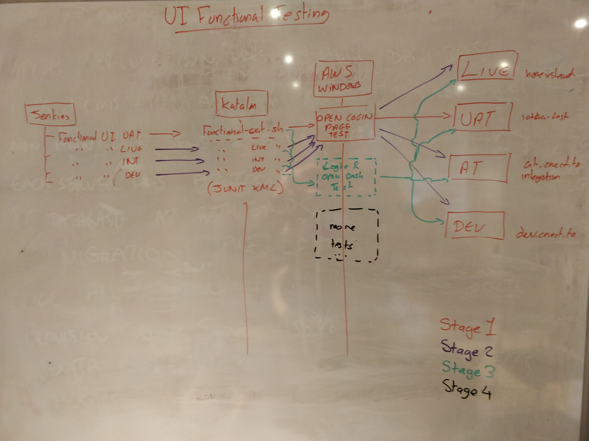

## Summary

This project focuses on functional UI and visual regression testing of the Dashboards and Family App. Below is a brief explanation of the repository contents.

## Workflow

Test case development should be carried out using the Katalon Git repo, on the local developers machine. 

## How to run the tests

The [UI Functional Testing Jenkins View](http://jenkins.aws.anthropos.io/jenkins/view/UI%20functional%20testing/) has 3 environments in which 3 test suites reside. Each environment test suite contains all relevant test cases that are ran against the Dashboard / Family App.

The 3 environments currently targeted:
- Integration: https://at.aws.anthropos.io
- Live: https://homeinstead.cnect.to/iotaa
- UAT: https://iotaa-test.anthropos.io

The jenkins jobs ssh into the Katalon server (Windows 10 AWS Instance - see http://gitlab.aws.anthropos.io/jcarney/aws-windows-vm for more information). Then a batch script is ran and carries out the following:
- Removes any previous report that has been ran for that environment
- A Katalon test suite is executed which then runs the containing test cases 
- The XML test result is saved to the Workspace for that job

The current line of thinking is that Jenkins will run the UI Functional Testing jobs once a night.

## UI Functional testing architecture

The project roughly adheres to the diagram below



-----

## Project structure
Below details the contents of the git repository

**mac-shell-scripts, windows-batch-scripts and linux-batch-scripts**

These contain the shell and batch scripts for running the tests in Console mode ( no need to manually open Katalon Studio ).

The Mac shell scripts are used for development and the Windows batch scripts are used for running the test suites on the Katalon server.

**iotaa-project**

The parent folder to the folders listed below. Note: this is the folder to open when using the Katalon IDE.

**Object Repository**

Contains all the elements recorded by the Web Recorder and edited for custom use. These are used by test cases so that they can find html elements ( Xpath is used to find elements ).

**Reports folder**

Contains a log of test suites ran in each environment. Each Jenkins job takes the `JUnit_Report.xml` which is created when each test suite is executed.

Note: The test case Jenkins console output is the same info printed to the Katalon console outout.

**Screenshots folder (visual regression testing)**

This contains `groundtruth.png` and `current.png`. 'groundtruth' is the definitive screenshot of the dashboards, and is used to compare the 'current' screenshot against.

Note: should still work but not currently maintained (18/2/19)

**Scripts folder**

The Scripts folder contains test cases. Currently the test cases are very basic, ie, logging into the Dashboard and Family App. In future, more complex test cases would be created, targeting things that Anthrpos is interested in testing.

- `Archived_test_cases` contains test cases that been previously used and act as a form of reference for code that been used. Of particular interest i the `dashboards` folder. 

- `Environments` contains all the environments the test cases should be ran in.

- `Iotaa_UtilityScripts` contains `RunCustomScenario` and `SaveIotaaFixture`: 'RunCustomScenario' takes care of running the scenarios in pumpAdmin. 'SaveIotaaFixture' takes care of re-fixturing the IoTAA fixture.

- `Testing_playground_test_case` is where tests are carried. Usuallly, when recording new things, this is the script to use.

**Test Cases**

References the Groovy scripts in the Scripts folder.

**Test Suites**

Contains the Groovy test suite files. The test suite files are used in the shell and batch files.

-----

## Passing and failing tests

At time of writing (29/03/18) the fail margin is very tight. In other words, a slight difference between screenshots will fail the assertion and deem the images as different.

This may be possible to amend (see https://github.com/yandex-qatools/ashot/tree/master/src/main/java/ru/yandex/qatools/ashot/comparison) but with no easily readable usage instructions or similar, this seems a long shot.

### Test failures - recognising what has failed
Some issues and errors encountered during development.

#### InvokerInvocationException: Assertion failed

`[ERROR]  - Test Cases/Iotaa_AllinOne/Iotaa_AllinOne FAILED because (of) org.codehaus.groovy.runtime.InvokerInvocationException: Assertion failed:`

This is a 'non login'. This error indicates that the AUT was unable to login to the dashboard, therefore, was unable to 'see' the Alerts card in the dashboard.

```
05-21-2018 11:18:40 AM - [WARNING] - Web element with id: 'Object Repository/IoTAA_Common_Items/AlertsCardNoRedCss' located by 'By.xpath: //div[@class="main-body"]/div[1]' not found
05-21-2018 11:18:40 AM - [FAILED] - Assertion failed:

assert WebUI.waitForElementVisible(findTestObject(findElement), 16, FailureHandling.STOP_ON_FAILURE)
             |                     |              |                                 |
             false                 |              |                                 STOP_ON_FAILURE
                                   |              IoTAA_Common_Items/AlertsCardNoRedCss
                                   TestObject - 'Object Repository/IoTAA_Common_Items/AlertsCardNoRedCss'

05-21-2018 11:18:40 AM - [END]    - End action : iotaaDashboardUtils.Utilities.loginIotaaDashboard
05-21-2018 11:18:40 AM - [ERROR]  - Test Cases/Iotaa_AllinOne/Iotaa_AllinOne FAILED because (of) org.codehaus.groovy.runtime.InvokerInvocationException: Assertion failed:

assert WebUI.waitForElementVisible(findTestObject(findElement), 16, FailureHandling.STOP_ON_FAILURE)
             |                     |              |                                 |
             false                 |              |                                 STOP_ON_FAILURE
                                   |              IoTAA_Common_Items/AlertsCardNoRedCss
                                   TestObject - 'Object Repository/IoTAA_Common_Items/AlertsCardNoRedCss'
```

Currently ( 21/05/2018 ), the test case will to try to login 3 times, then stop running and throw an assertion error. The test suite will run 3 times in all, giving us 9 total login attempts.

---

#### AssertionError: expected [false] but found [true]

`05-29-2018 11:50:30 AM - [FAILED] - Test Cases/Iotaa_dashboard_test_case/Iotaa_dashboard_test_case FAILED because (of) java.lang.AssertionError: expected [false] but found [true]`

This is usually an indicator that the UI has changed, ie, a change has been made to the dashboard UI. Currently, at time of writing ( 29/05/18 ), when a UI change has been checked-in, the first test will fail, then succeed on the second test.

This is because of the 'previous' screenshot getting replaced with the 'current' screenshot, basically the screenshots are the same which is why it passes.

If the tests fail on the second attempt, its probably due to something else.

`diff.hasDiff() is true
05-29-2018 11:50:30 AM - [PASSED] - com.at.util.ScreenshotHelper.compareImages is PASSED
05-29-2018 11:50:30 AM - [END]    - End action : Statement - org.testng.Assert.assertFalse(CustomKeywords.com.at.util.ScreenshotHelper.compareImages())
05-29-2018 11:50:30 AM - [FAILED] - Test Cases/Iotaa_dashboard_test_case/Iotaa_dashboard_test_case FAILED because (of) java.lang.AssertionError: expected [false] but found [true]
05-29-2018 11:50:30 AM - [END]    - End Test Case : Test Cases/Iotaa_dashboard_test_case/Iotaa_dashboard_test_case
05-29-2018 11:50:32 AM - [END]    - End Test Suite : Test Suites/Iotaa_dashboard_test_suite/Iotaa_dashboard_test_suite`

#### Unable to click on object 'Object Repository/IoTAA_PumpAdmin/a_Save Fixture'

This error indicates that PumpHouse is currently down on the test server. This is mostly likely due to PumpHouse being rebuilt.  This isnt really anything to worry about, the tests should re-run later when PumpHouse shold be back up and runnning.

```
[FAILED] - Unable to click on object 'Object Repository/IoTAA_PumpAdmin/a_Save Fixture' (Root cause: com.kms.katalon.core.webui.exception.WebElementNotFoundException: Web element with id: 'Object Repository/IoTAA_PumpAdmin/a_Save Fixture' located by 'By.xpath: //a[@href = '/PumpHouse/pumpAdmin/refixture' and (text() = 'Save Fixture' or . = 'Save Fixture')]' not found)
```

### Dont switch screens during tests
Update 8/4/19:
If appears that using `WebUI.verifyElementVisible()` and switching between applications on your local dev machine will cause tests to error. It seems that Katalon needs the renderer to paint to the screen to that it can actually determine if the element is visible. However, the issue does not appear for tests are run in headless mode which should be the intended mode when being run on the AWS Windows 10 server. It is recommended not to switch between screens on the local machine you are running tests on.

At the point of screen capture if you switch to another window / open program this gives different results. The thing to do is to leave the test to run isolated with no interaction until the test has fully ran.

Update 22/05/18:
When running tests on a Mac laptop with an additional screen attached ( ie, displays partially on the mac screen with some part of it hidden ) and maximising the browser window by clicking the green window button, causes the browser window to maximise at different resolutions.

The following screen sizes have been recorded

2880 × 1416: this size causes errors

2880 × 1420: this seems to be the error free 'correct' screen size

### Running like-for-like

It seems that running a test in IDE mode and comparing it to a screenshot take using Console mode gives 2 different results (image resolution varies). You should run tests like-for-like so run all in the IDE OR run all via the Console.

## Cross browser desktop testing

09/05/18: As Firefox was causing lots of headaches some investigation was made into ensuring all desktop browsers are supported.

### Chrome
This dosnt need anything special to run inside of

### Firefox
- Specifically need to use the Firefox [Katalon Recorder (Selenium IDE for FF55+)](https://addons.mozilla.org/en-US/firefox/addon/katalon-automation-record/) plugin as some parts of the Katalon WebUI API don’t work with Firefox
- Currently Utilities.groovy has been updated to check if the AUT is running within Firefox and will use the native Selenium commands as opposed to the Katalon WebUI commands

### Edge
- Is currently not supported. Katalon currently does not support MicrosoftWebDriver.exe version 17763

### Safari
- To get Safari to recognise the Katalon tests you need to change the below setting
 - Go to: Develop > Allow Remote Automation
 - Note: I have noticed the path to some JAR files are not recognised so closing down the project and reopening resolved the issue. This appears to be the path used on a different operating system.

## !MESSAGE An internal error occurred during: "Refreshing workspace"

If you get the above issue, try removing the downloaded Katalon instance being used for the tests, and replacing it with a freshly downloaded version ( making sure it is in the same location ). After doing this, your tests should be able to run successfully again.

## Potential future improvements 

### Cucumber testing
11/10/18: The project has some initial tests for testing system pause functionality.

To run the tests, go to Include > features, in side you will see the .feature files ( these are the cucumber files written in Gherkin ). Click the play button ( Firefox tends to error often when trying to login to the dashboard, so simply use Chrome ).

To view the groovy files which contain the Cucumber Step Definitions ( which actually carry out the test ), go to scripts > groovy > iotaaDashboards

Resources:
I used this video for learning how to carry out BDD tests in Katalon (Katalon Studio 5.7 with Cucumber Behavior-Driven Development (BDD) support)[https://www.youtube.com/watch?v=vwCSfUhsivY]

## Progess

2/5/19

## Compiling gherkin doc

Ideally we should only be documenting reusable code, ie, gherkin that can be written in future and works with existing glue code.

To compile dictionary files, go to the root of the katalon-testing directory and run 

```
groovy /Users/jasoncarney/repository/visual-regression-testing/dictionary-doc/gherkin-doc.groovy "iotaaDashboardUtils" "glueCode"

```

1/5/19:

## Approach
After more work on the project, it appears that using lower level gherkin is better as you get more flexibility when writing features, ie, one gherkin step carries out one thing in the bound glue code function.

## Reusable vs Hard coded glue code
The approach to glue code creation should be something like 75% reusable code vs 25% hard coded. In essence, we should mainly aim to write reusable glue code for feature files, but where glue code is difficult to write, a hard coded version should be written so that the test in question can be progressed.

## Where should hard coded glue code reside
Hard coded glue code shuold reside in Keyword files named after their respective feature files. An example that may make things clearer is below:

```
localOfficeCreateNewOrder_regressionTest
```

This Keyword file should only contain specific glue code for local office new order.

## Where should reusable glue code reside
In any Keyword file that is deemed appropriate for the glue code to reside in, ie, not a specific file like `localOfficeCreateNewOrder_regressionTest`

## Guide to writing reusable gherkin
The gherkin writer should be able to refer to the Dictionary for copying and pasting into the appropriate features.

## Guide to writing reusable Glue Code
An example glue code function:

```
/** @anthropos-gherkin:
 * Step: I enter (.*) in the (.*) field in the (.*) appflow. Description: Use this step for entering values into input fields. <br><br><strong>Example usage:</strong><br>I enter Ferrari in the Surname field.
 */
@Given('I enter (.*) in the (.*) field')
def i_enter_x_in_the_x_field(String inputValue, String inputField) {   
    def xpathQuery = "//label[contains( text(), '"+inputField+"' ) ]/following-sibling::input"

    def inputFieldObject = new TestObject('inputFieldObject')
    inputFieldObject.addProperty("xpath", ConditionType.EQUALS, xpathQuery, true)
    WebUI.setText(inputFieldObject, inputValue)
}
```

### Comment
- Step: Enables the reader to copy the Gherkin, and replace the varibles with the values they want.
- Description: Tells the reader how to use the Step.
- Example usage: Gives the reader a solid example of how to use the Step

### Function name and arguments
The function name should be the same as the gherkin keyword, where
- underscores replace spaces
- regular expressions are replaced with the letter 'x'

Function argument names should describe the 'thing' itself, in the example below we care about
- The input value
- The input field label 

```
def i_enter_x_in_the_x_field(String inputValue, String inputField) { ... }
```

### Xpath query
Create an `xpathQuery` variable that holds the xpath query such as below:

```
def xpathQuery = "//label[contains( text(), '"+inputField+"' ) ]/following-sibling::input"
```

### Test object
Create a new test object and add an xpath property. This will check if the xpath query is matched.
We should 
- Create an object that is named after the element with 'Object' appended to the name
- Use the xpathQuery variable as an argument
- The last true argument, i think, informs the test that the html element is present in the DOM

```
def inputFieldObject = new TestObject('inputFieldObject')
inputFieldObject.addProperty("xpath", ConditionType.EQUALS, xpathQuery, true)
```

### Katalon method calls
Use the Katalon API to operate on the element. In the example below, we add some text the input field html element. The code is fairly descriptive about what its doing:

```
WebUI.setText(inputFieldObject, inputValue)
```

## Guide to writing hard coded Gherkin
Hard coded glue code should have an underscore prefixed to the Gherkin step in question. The rest of the wordage in the Gherkin step should have some variation such as additional / removal of words (so to avoid Ambiguous Step Definition errors), however the Gherkin should still make sense to the reader.

An example:

```
_choose Hallway from Front door sensor dropdown in Standard Devices appflow
```

## Guide to writing hard coded Glue Code
Hard coded Glue Code functions should have an underscore prefix to denote that its hard coded. An example:

```
def _i_enter_x_in_the_x_field_in_the_x_appflow(String inputValue, String inputField, String appflowScreen) { ... }
```

- 4/4/19: 

    ### Architecture diagram
    - https://www.lucidchart.com/documents/edit/8ac09420-3549-47c1-a70c-6841bd8c8848/0
    
    ### General guide
    - Wide coverage: This tests lots of Scenarios in one feature. An example is the installation tool feature.
        - Preferred over narrow coverage? Fewer Scenarios in one feature.
        - 

    ### Anatomy of feature file
    - Feature / test goal: Describes only one product feature, ie, Login, Use installation tool. Is a file that contains Gherkin.

    - Scenarios: Are containers which should summarise the Gherkin Steps within, ie, Create a client, Select a client

    - Step Definitions: Prefixed by a Gherkin keyword like 'Given, And, Then'. There after, it contains the content business rules.

    - Glue Code: The code that is bound to a Step Definition. This will run code in a web browser.

    ### Things to consider:
    - Scalability: many test cases in one test suite, do we want to run loads of tests?
    - What to test: a list of things we want to test.


- 1/4/19: R and D server > ian.install: user currently not available


