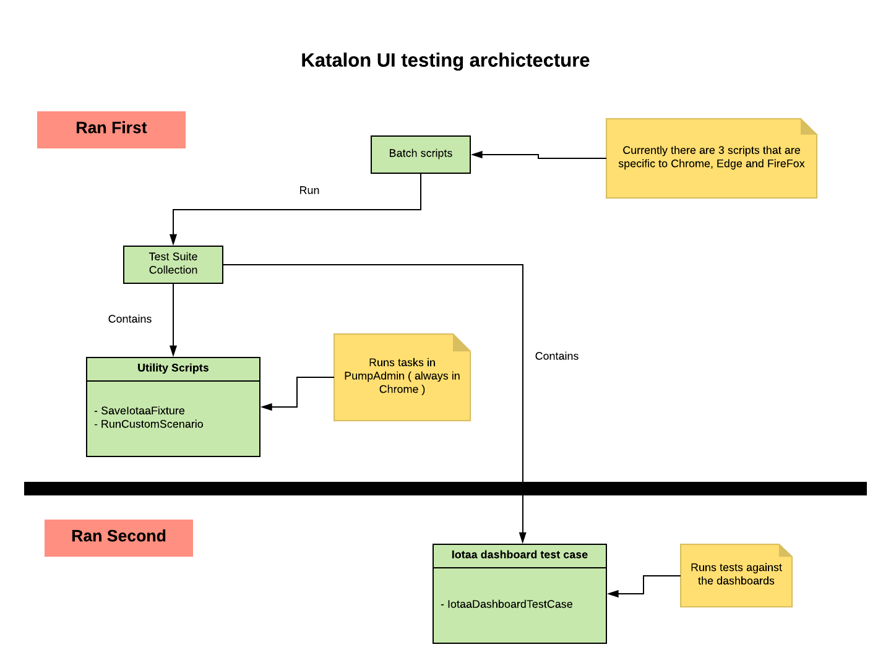

## Summary

This project currently focuses on functional UI and visual regression testing of the IoTAA Local Office. Below is a brief explanation of the repository contents

## Workflow

Development should be done on Windows / Windows VM.

No changes should be checked-in from the Windows machine; if the working directory becomes dirty but theres no need to do anything - just dont check-in code!

## Katalon UI testing architecture

The following diagram should outline how the project is setup



## mac-shell-scripts, windows-batch-scripts and linux-batch-scripts
These contain the shell and batch scripts for running the tests in Console mode ( no need to manually open Katalon Studio ).

~~ The shell script ran by Jenkins is `linux-shell-scripts/iotaa_dashboard_test_case.sh` - the Jenkins task can be found here - http://vcs.healthcog.org:8081/view/katalon-testing/job/katalon%20testing%20project/configure ~~

## Cucumber testing
11/10/18: The project has some initial tests for testing system pause functionality.

To run the tests, go to Include > features, in side you will see the .feature files ( these are the cucumber files written in Gherkin ). Click the play button ( Firefox tends to error often when trying to login to the dashboard, so simply use Chrome ).

To view the groovy files which contain the Cucumber Step Definitions ( which actually carry out the test ), go to scripts > groovy > iotaaDashboards

Resources:
I used this video for learning how to carry out BDD tests in Katalon (Katalon Studio 5.7 with Cucumber Behavior-Driven Development (BDD) support)[https://www.youtube.com/watch?v=vwCSfUhsivY]

## iotaa-project

The parent folder to the folders listed below. Note: this is the folder to open when using the Katalon IDE.

### Object Repository

Contains all the elements recorded by the Web Recorder. These are used by test cases so that they can find html elements ( Xpath is used to find elements ).

### Reports folder

`Reports` folder contains a log of all tests ran. This is useful for getting easy to read information in HTML format. Note, this is the same info printed to the terminal and Jenkins log.

**Update 10/09/18**

`Iotaa_dashboard_test_suite` and `UtilityScripts` should be used to see the pass / fail activity for the Edge, Chrome and Firefox test suite collections.

### screenshots folder

This contains `groundtruth.png` and `current.png`. 'groundtruth' is the definitive screenshot of the dashboards, and is used to compare the 'current' screenshot against.

### Scripts folder
The Scripts folder contains the test cases generated by the Web Recorder.

`Archived_test_cases` contains test cases that been previously used and kept for archival purposes.

`Iotaa_dashboard_test_case` contains the main test case that drives the dashboards.

`Iotaa_UtilityScripts` contains `RunCustomScenario` and `SaveIotaaFixture`: 'RunCustomScenario' takes care of running the scenarios in pumpAdmin. 'SaveIotaaFixture' takes care of re-fixturing the IoTAA fixture.

`Testing_playground_test_case` is where tests are carried. Usuallly, when recording new things, this is the script to use.

### Test Cases

TODO

### Test Suites

`Chrome_Local_Office_TestSuiteCollection` is a collection of test suites that includes `UtilityScripts` and `iotaa_dashboard_test_case`

Similarly, `Edge_Local_Office_TestSuiteCollection` and `Firefox_Local_Office_TestSuiteCollection` are the same but are ran in respective web browsers.

`testing_playground_test_suite` is intended for running the testingPlayground test cases.

### vmware-guest-console

**Update 11/09/18: Currently not used as VMWare dosnt support Windows 10**

~~This is config for connecting to the server using VMWare Guest Console. To use, open up VMWare Guest Console, ctrl + o, navigate to iotaa-project/vmware-guest-console and double click `vmware-guest-console.vgc`~~

## How to run the tests:

### Windows OS

**Update 12/09/18: windows-batch-scripts/katalon-automation.bat**
- This script will ideally be ported over to Ansible to make things more automated. the contents of the script may no longer be relevant, as i will probably want Ansible to take care of Installig Chrome, Setting up git, Clone Katalon repo, Downloading Katalon executable, Manually renaming Katalon downloaded executable to "katalon_studio", Replacing Edge web driver with compatible version, Running repo

Note: not too sure if we care about clicking the Allow Access button for "windows defender firewall has blocked some features of this app" message that Windows pops up

**Update 07/09/18: test suite collection added**
- Currently, Edge testing is only geared for working on a local Parallels VM

- Some changes have been made to work around the http auth issue in Edge. The way this was solved was by off loading the saveIotaaFixture() and runCustomScenario() tasks to there own test cases, and adding them to a test suite collection.

- The test suite collection re-fixtures in Chrome and then runs the iotaa dashboard test case in the browser of choice, using the format `browserName_iotaa_dashboard_test_case.bat`

**Update 07/09/18: External running of tests on Edge**
- This has proved difficult to get going. At time of writing the VMWare servers dont support Windows 10, and the free AWS instances run Windows server datacenter 2016, which dosnt support Edge.

**Update 07/09/18: VMWare Windows 7 server**
- There is a VMWare server with Windows 7 installed `KatalonWin7`. Windows 7 however only supports IE11 and below.

**How to run the tests**
- Ensure a local Windows 10 VM is installed (Parallels / Virtual Box etc) then login to the VM

- Download [Katalon Studio](https://www.katalon.com/download/) to `%USERPROFILE%\Documents` ( which should be C:\Users\yourname\repository ). You will need to create a free account in order to download and starting using

- **07/09/18**: Note this has yet to be done so dont follow this task:

~~Rename the folder to 'Katalon_Studio_Windows' ( removing the version number ). This should allow you to update the version of Katalon you are using and still have the batch scripts work ( as this is a manual task, an issue has been added to Trello - 'Katalon: Change folder name for windows batch scripts' )~~

- Clone the katalon-testing repository to `%USERPROFILE%\repository` ( which should be C:\Users\yourname\repository )
- Open the command line ( dont use Git Bash, use the native Windows Command Prompt )
- Run:

```
cd %USERPROFILE%\repository\katalon-testing\windows-batch-scripts

```

Then, to run the scripts in Edge, run:

```
edge_iotaa_dashboard_test_case.bat
```

For firefox run:

```
firefox_iotaa_dashboard_test_case.bat
```

For Chrome run:
```
chrome_iotaa_dashboard_test_case.bat
```

Once a test has been run, the path will change to 'katalon download' folder. To run the windows batch scripts again go to
```
cd ..\..\repository\katalon-testing\windows-batch-scripts
```

### Ubuntu test server ( using VMWare )

**Update 07/09/18:Focus shifted to Windows testing**
- The ubuntu server has been deleted and Ubuntu testing is no longer a focus - Windows is now the focus as this represents the user base.

~~Currently ( 29/05/18 ), a test server ( 192.168.1.134, user: ubuntu, password: password ) is setup to run the tests on AT.~~

~~To interface with the server, a Windows 10 Parallels VM is using VMWare Guest Console ( a login profile can be found at `iotaa-project/vmware-guest-console` ) logs into the GUI.~~

~~You can login to the GUI by selectng `UbuntuTestDesktop` server then login with
~~- ubuntu~~
~~- password~~

~~You can also login via the terminal using `ssh ubuntu@192.168.1.134` and 'password'.~~

~~The `katalon-testing` folder resides at `/home/ubuntu/repository`~~

### Mac OS

**Update 11/09/18: Instructions for running on Mac**

- More than likely this will be the same as Windows ie, port over browserName_iotaa_dashboard_test_case to browserName_iotaa_dashboard_test_case.sh

~~Download and install [Katalon Studio](https://www.katalon.com/download/) - you will need to create a free account in order to download and starting using~~

~~- Clone the katalon-testing repository to `~/repository`~~
~~- Ensure Katalon is installed~~
~~- Open the command line~~
~~- Run:~~

~~```~~
~~cd ~/repository/katalon-testing/~~

~~./first-time-setup.sh~~
~~```~~

~~- Once thats finished run the following:~~

~~```~~
~~cd ~/repository/katalon-testing/~~

~~./continuous-tests.sh~~
~~```~~

## Passing and failing tests

At time of writing (29/03/18) the fail margin is very tight. In other words, a slight difference between screenshots will fail the assertion and deem the images as different.

This may be possible to amend (see https://github.com/yandex-qatools/ashot/tree/master/src/main/java/ru/yandex/qatools/ashot/comparison) but with no easily readable usage instructions or similar, this seems a long shot.

### Test failures - recognising what has failed

#### InvokerInvocationException: Assertion failed

`[ERROR]  - Test Cases/Iotaa_AllinOne/Iotaa_AllinOne FAILED because (of) org.codehaus.groovy.runtime.InvokerInvocationException: Assertion failed:`

This is a 'non login'. This error indicates that the AUT was unable to login to the dashboard, therefore, was unable to 'see' the Alerts card in the dashboard.

```
05-21-2018 11:18:40 AM - [WARNING] - Web element with id: 'Object Repository/IoTAA_Common_Items/AlertsCardNoRedCss' located by 'By.xpath: //div[@class="main-body"]/div[1]' not found
05-21-2018 11:18:40 AM - [FAILED] - Assertion failed:

assert WebUI.waitForElementVisible(findTestObject(findElement), 16, FailureHandling.STOP_ON_FAILURE)
             |                     |              |                                 |
             false                 |              |                                 STOP_ON_FAILURE
                                   |              IoTAA_Common_Items/AlertsCardNoRedCss
                                   TestObject - 'Object Repository/IoTAA_Common_Items/AlertsCardNoRedCss'

05-21-2018 11:18:40 AM - [END]    - End action : iotaaDashboardUtils.Utilities.loginIotaaDashboard
05-21-2018 11:18:40 AM - [ERROR]  - Test Cases/Iotaa_AllinOne/Iotaa_AllinOne FAILED because (of) org.codehaus.groovy.runtime.InvokerInvocationException: Assertion failed:

assert WebUI.waitForElementVisible(findTestObject(findElement), 16, FailureHandling.STOP_ON_FAILURE)
             |                     |              |                                 |
             false                 |              |                                 STOP_ON_FAILURE
                                   |              IoTAA_Common_Items/AlertsCardNoRedCss
                                   TestObject - 'Object Repository/IoTAA_Common_Items/AlertsCardNoRedCss'
```

Currently ( 21/05/2018 ), the test case will to try to login 3 times, then stop running and throw an assertion error. The test suite will run 3 times in all, giving us 9 total login attempts.

---

#### AssertionError: expected [false] but found [true]

`05-29-2018 11:50:30 AM - [FAILED] - Test Cases/Iotaa_dashboard_test_case/Iotaa_dashboard_test_case FAILED because (of) java.lang.AssertionError: expected [false] but found [true]`

This is usually an indicator that the UI has changed, ie, a change has been made to the dashboard UI. Currently, at time of writing ( 29/05/18 ), when a UI change has been checked-in, the first test will fail, then succeed on the second test.

This is because of the 'previous' screenshot getting replaced with the 'current' screenshot, basically the screenshots are the same which is why it passes.

If the tests fail on the second attempt, its probably due to something else.

`diff.hasDiff() is true
05-29-2018 11:50:30 AM - [PASSED] - com.at.util.ScreenshotHelper.compareImages is PASSED
05-29-2018 11:50:30 AM - [END]    - End action : Statement - org.testng.Assert.assertFalse(CustomKeywords.com.at.util.ScreenshotHelper.compareImages())
05-29-2018 11:50:30 AM - [FAILED] - Test Cases/Iotaa_dashboard_test_case/Iotaa_dashboard_test_case FAILED because (of) java.lang.AssertionError: expected [false] but found [true]
05-29-2018 11:50:30 AM - [END]    - End Test Case : Test Cases/Iotaa_dashboard_test_case/Iotaa_dashboard_test_case
05-29-2018 11:50:32 AM - [END]    - End Test Suite : Test Suites/Iotaa_dashboard_test_suite/Iotaa_dashboard_test_suite`

#### Unable to click on object 'Object Repository/IoTAA_PumpAdmin/a_Save Fixture'

This error indicates that PumpHouse is currently down on the test server. This is mostly likely due to PumpHouse being rebuilt.  This isnt really anything to worry about, the tests should re-run later when PumpHouse shold be back up and runnning.

```
[FAILED] - Unable to click on object 'Object Repository/IoTAA_PumpAdmin/a_Save Fixture' (Root cause: com.kms.katalon.core.webui.exception.WebElementNotFoundException: Web element with id: 'Object Repository/IoTAA_PumpAdmin/a_Save Fixture' located by 'By.xpath: //a[@href = '/PumpHouse/pumpAdmin/refixture' and (text() = 'Save Fixture' or . = 'Save Fixture')]' not found)
```

### Dont switch screens during tests

It is recommended not to switch between screens on the machine you are running tests on as i have found that resolution varies. At the point of screen capture if you switch to another window / open program this gives different results. The thing to do is to leave the test to run isolated with no interaction until the test has fully ran.

Update 22/05/18:

When running tests on a Mac laptop with an additional screen attached ( ie, displays partially on the mac screen with some part of it hidden ) and maximising the browser window by clicking the green window button, causes the browser window to maximise at different resolutions.

The following screen sizes have been recorded

2880 × 1416: this size causes errors

2880 × 1420: this seems to be the error free 'correct' screen size

### Running like-for-like

It seems that running a test in IDE mode and comparing it to a screenshot take using Console mode gives 2 different results (image resolution varies). You should run tests like-for-like so run all in the IDE OR run all via the Console.

## Cross browser desktop testing

09/05/18: As Firefox was causing lots of headaches some investigation was made into ensuring all desktop browsers are supported.

### Chrome
This dosnt need anything special to run inside of

### Firefox
- Specifically need to use the Firefox [Katalon Recorder (Selenium IDE for FF55+)](https://addons.mozilla.org/en-US/firefox/addon/katalon-automation-record/) plugin as some parts of the Katalon WebUI API don’t work with Firefox
- Currently Utilities.groovy has been updated to check if the AUT is running within Firefox and will use the native Selenium commands as opposed to the Katalon WebUI commands

### Edge
- You need to install the correct version of Edge WebDriver
 - In a nutshell you can download from MS WebDriver
 - You need the appropriate version for the build of windows
 - Place the web driver.exe at Katalon Studio Windows 64\configuration\resources\drivers\edgedriver
 - Resources: https://forum.katalon.com/discussion/2362/katalon-with-microsoft-edge

### Safari
- To get Safari to recognise the Katalon tests you need to change the below setting
 - Go to: Develop > Allow Remote Automation
 - Note: I have noticed the path to some JAR files are not recognised so closing down the project and reopening resolved the issue. This appears to be the path used on a different operating system.

## !MESSAGE An internal error occurred during: "Refreshing workspace"

If you get the above issue, try removing the downloaded Katalon instance being used for the tests, and replacing it with a freshly downloaded version ( making sure it is in the same location ). After doing this, your tests should be able to run successfully again.

--------------------------------------------------------------------------------

## ARCHIVED: Setup and configuration

### 21/03/18 Note: Only use the below if you want to install and use local Jenkins and Git on Windows VM

### Jenkins
* Download Jenkins: https://jenkins.io/download/thank-you-downloading-windows-installer-stable/
* Leave everything as default
* Create a new job
* Add name such as KatalonTestSuiteRun
* Create a Freestyle project
* Add a Description
* Under Source Code Management
    * Select Git, add http://git.healthcog.org/jcarney/katalon-testing.git to the Repository URL field
    * In the Credentials field click add button:
        * Username: username@domain.co.uk
        * Password: your git password
* Under Build Triggers
    * Select Poll SCM
    * To poll every minute add
        * * * * * *
* Under Build environment
    * Select "Delete workspace before build starts"
* Click on the Build tab or scroll down to Build
    * Click Execute Windows batch command
    * Add the following:
```
cd C:\Users\IEUser\Documents\Katalon_Studio_Windows_64-5.3.1\Katalon_Studio_Windows_64-5.3.1
katalon -noSplash  -runMode=console -consoleLog=Y -noExit=Y -email="username@domain.co.uk" -projectPath="C:\Users\IEUser\Documents\katalon-iotaa-project\iotaa-project\iotaa-project.prj" -statusDelay=5 -retry=2 -retryFailedTestCases=true -testSuitePath="Test Suites/iotaa_test_cases" -browserType="Chrome"
```
* ​Click Apply button
* Click Save button

### Git
* Run Windows command line as Administrator
* From Windows command line git clone http://vcs.healthcog.org/jcarney/katalon-testing
* This should put it into "C:\Program Files (x86)\Jenkins\workspace\KatalonTestSuiteRun”
    * cd "C:\Program Files (x86)\Jenkins\workspace\KatalonTestSuiteRun”
* Make a change to a file ( If you want to modify a Katalon file, run Katalon as administrator  )
* Git add, commit and push - make sure to close down the text editor and command line as Jenkins will fail due to “program currently open”
    * When they are closed Jenkins will run the test

### Katalon

* Download for Windows
* Run katalon.exe
* Once it loads open up the cloned iotaa project

## test aws from home
